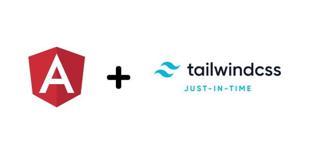

# ng-tailwindcss-jit


Configures your angular project to use jit compiler for tailwindcss



## Usage

```
npx ng-tailwindcss-jit
```

## Demo

https://github.com/apvarun/demo-ng-tailwindcss-jit

## Prerequisites

- Project must have Tailwind CSS installed
- Minimum angular version 11.2 (version from which angular supports Tailwind CSS out-of-the-box)
- Should be using the default angular builder

## How it works

**Read article:** https://apvarun.com/blog/tailwindcss-jit-in-angular

## Contributing

Pull requests are welcome. For major changes, please open an issue first to discuss what you would like to change.

## License

This project is licensed under the MIT License - see the [LICENSE](./LICENSE) file for details
